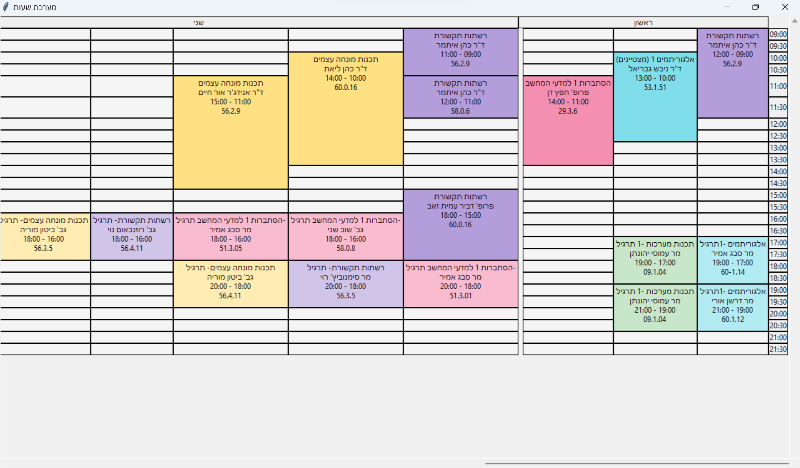

I write full directions in Hebrew [here](assets/הסבר.pdf).

this small project helps me to build my schedule.

my university gives me the lectures schedule in a pdf file, and in rows and columns format, so I need to convert it to a
table format(cvc file), and from there to display it in a calendar format.

so I wrote this small project to help me with that.

In this project, I convert the pdf file to csv file, and then I display it in a calendar format.

| original                         | output                             |
|----------------------------------|------------------------------------|
|  |  |

## How to use it

if you want to run it:
make sure that you have python 3.6 or higher installed on your computer.
make sure that you have java installed on your computer, and the system variable `JAVA_HOME` is set to the java
installation folder.

now, you cen run the following command:

```bash
python main.py
```

and a window will open with the calendar.


## Work with your own schedule

if you want to change the data, you have two options:

1. create your own csv file, and replace the [file](data/clean_data.csv) in the data folder.
   make sure that the file name is the same as the original file name, and that the file is in the same format.
2. convert a pdf file to csv. you can see full directions [here](assets/הסבר.pdf).